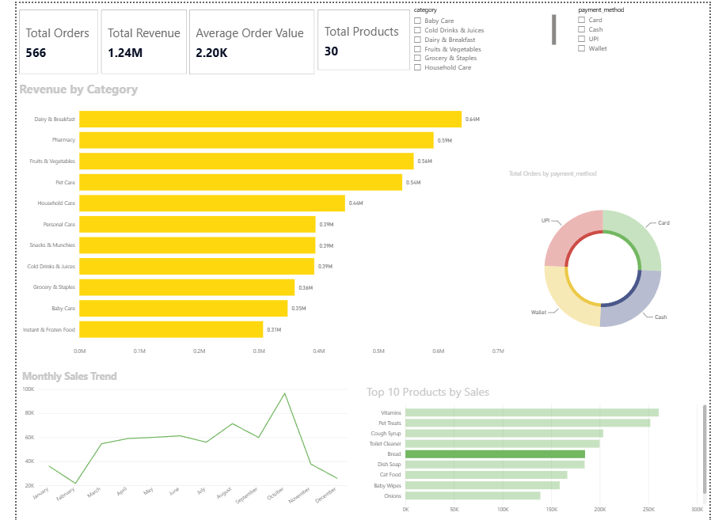

# Blinkit-Sales-Dashboard

## Project Overview

Developed an interactive Power BI dashboard to analyze Blinkit sales performance using SQL and Power BI.

## Tools Used

- SQL
- MySQL
- Power BI
- Excel

## Key Insights

- Total Revenue
- Total Orders
- Average Order Value
- Total Products Sold
- Revenue by Category
- Monthly Sales Trend
- Payment Method Distribution
- Top 10 Products

## Features

- Interactive slicers
- KPI Cards
- Dynamic visualizations
- SQL data extraction
- Clean data model

## Dashboard

